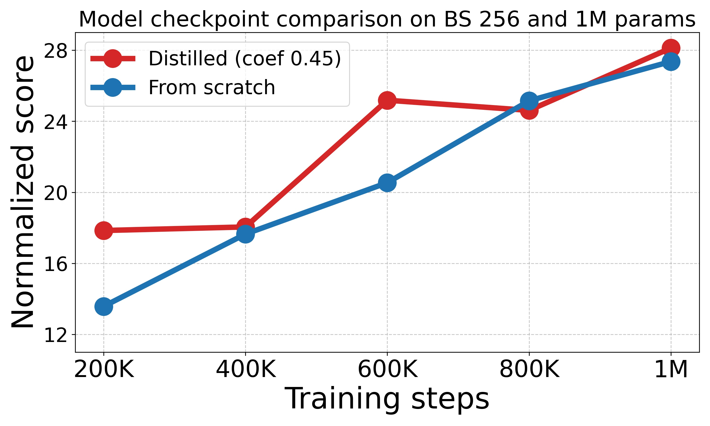

# TD-MPC-Opt: Distilling Model-Based Multi-Task Reinforcement Learning Agents
[Paper](https://arxiv.org/abs/2501.05329)


----------------------------------------------------------------------------------
## 🚀 Overview
TD-MPC-Opt extends **[TD-MPC2](https://github.com/nicklashansen/tdmpc2)** by introducing a distilled, quantized version of the multi-task reinforcement learning agent. This approach improves computational efficiency while maintaining strong performance across the **MT30** benchmark.

This repository provides:
- Training scripts for student-teacher distillation and from-scratch learning.
- Checkpoints for quantized models distilled on MT30.
- Support for post-training quantization (FP16, INT8, Mixed Precision).
- Evaluation and logging via Weights & Biases (W&B).

- Checkpoints (1M steps, batch size 256) are stored in `./tdmpc2/models`

## Installation
*Retained from [TD-MPC2 repo](https://github.com/nicklashansen/tdmpc2).*

You will need a machine with a GPU and at least 12 GB of RAM for single-task online RL with TD-MPC**2**, and 128 GB of RAM for multi-task offline RL on our provided 80-task dataset. A GPU with at least 8 GB of memory is recommended for single-task online RL and for evaluation of the provided multi-task models (up to 317M parameters). Training of the 317M parameter model requires a GPU with at least 24 GB of memory.

We provide a `Dockerfile` for easy installation. You can build the docker image by running

```
cd docker && docker build . -t <user>/tdmpc2:1.0.0
```

This docker image contains all dependencies needed for running DMControl, Meta-World, and ManiSkill2 experiments.

If you prefer to install dependencies manually, start by installing dependencies via `conda` by running the following command:

```
conda env create -f docker/environment.yaml
pip install gym==0.21.0
```

The `environment.yaml` file installs dependencies required for training on DMControl tasks. Other domains can be installed by following the instructions in `environment.yaml`.

## 📚 Dataset
Training is conducted on the MT30 dataset:

- Size: 690,000 episodes (345,690,000 transitions)
- Preparation: Follow instructions from [TD-MPC2](https://www.tdmpc2.com/dataset).

Original TD-MPC2 Checkpoints: [Download](https://www.tdmpc2.com/models)

## Training  
Training is configured using Hydra. The key configuration files are:
- *Student config*: `./tdmpc2/student_config/config_mt30.yaml`
- *Teacher config*: `./tdmpc2/student_config/config_multi_distill_317M.yaml`
- *Global config*: `./tdmpc2/generic.yaml` (merges student & teacher settings)
These configs define architecture, hyperparameters, sampling strategies, and MPC components. To modify any aspect of training, update these YAML files accordingly.
Modify them as needed before running:
```python train.py``` (see the script for the full list of cmd parameters)

The distillation coefficient is an important parameter that defines the impact of distillation loss on the overall learning process

[!dist](./assets/table1.png)

### Training Variations
- Batch Size: Reducing from 1024 (original) to 256 tends to improve convergence consistently.
- Extended Distillation: Training for 1M steps (vs. 200K or 337K) enhances generalization and performance.

### Training Pipeline
The `train.py` script initializes training with:
```
@hydra.main(config_name='generic', config_path='.')
def train(cfg: dict):
```
The teacher model (if present) is loaded from cfg.teacher_config.
The student model can be trained:
- With distillation: `TDMPC2(cfg_student, teacher_model)`
- From scratch: `TDMPC2(cfg_student)`

Example:
```
# Load teacher (optional for distillation)
cfg_teacher = parse_cfg(cfg.teacher_config)
teacher_model = TDMPC2(cfg_teacher)
teacher_model.load(cfg_teacher.checkpoint)

# Load student
cfg_student = parse_cfg(cfg.student_config)
student_model = TDMPC2(cfg_student, teacher_model)  # Distillation
# student_model = TDMPC2(cfg_student)  # From scratch

```
----------------------------------------------------------------------------------
## Evaluation
Run evaluation using:
``` python evaluate.py checkpoint=./tdmpc2/models/mt30_1M_steps_045dist_fp16.pt ```
or any other checkpoint name.
Evaluation is configured via:
```
@hydra.main(config_name='config_mt30', config_path='./student_config')
def evaluate(cfg: dict):
```
The script also supports loading quantized checkpoints via `load_state_dict`:
```
# Load quantized model
state_dict = torch.load('./tdmpc2/models/mt30_distill_fp16.pt')
agent.model.load_state_dict(state_dict['model'])
```
----------------------------------------------------------------------------------
## Post-Training Quantization
To apply FP16, INT8, or Mixed Precision quantization, use the adjust quantization script:
```
python quantize.py --checkpoint ./tdmpc2/models/mt30_1M_steps_045dist.pt 
```
----------------------------------------------------------------------------------
## Logging with W&B
Set up Weights & Biases in the config:
```
# logging
wandb_project: ???  # Your W&B project name
wandb_entity: ???   # Your W&B entity
```
----------------------------------------------------------------------------------
## 📜 Citation
If you find our work useful, please consider citing:
```
@misc{kuzmenko2025knowledge,
    title={Knowledge Transfer in Model-Based Reinforcement Learning Agents for Efficient Multi-Task Learning},
    author={Dmytro Kuzmenko and Nadiya Shvai},
    year={2025},
    eprint={2501.05329},
    archivePrefix={arXiv},
    primaryClass={cs.LG}
}
```
----------------------------------------------------------------------------------
## License

This project is licensed under the MIT License - see the `LICENSE` file for details. Note that the repository relies on third-party code, which is subject to their respective licenses.
